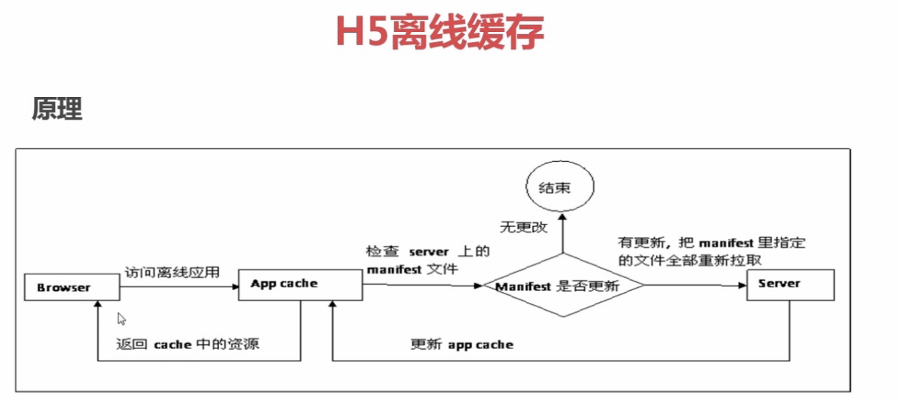

# 一、HTML5离线缓存

## 1. 客户端存储历程

1. 1 浏览器端在H5之前使用cookie和userdata：cookie问题：http请求头上带着、大小4k（太小）、主DOMain污染
1. 2 H5存储方式:
+ 本地存储 loacalstorage&&sessionstorage
+ 离线缓存 application cache
+ indexedDB 和web Sql

## 2. loccalstorage && sessionStroage存储形式

 1. 存储形式key-value

 2. 过期：

* loccalstorage 永久存储 永不失效，除非手动删除
* sessionstorage 关闭浏览器后即消失

3. 大小：每个域名5M

4. 使用方法,Localstorage API介绍

* getItem
* setItem
* removeItem
* key
* clear

```javascript
```

```javascript
localstorage.setItem("test1","test1");
localstorage.getItem("test1");
localstorage.key(0);
localstorage.key(1);
localstorage.clear();
```

5. 可以存储的东西：数组 、json数据、图片、脚本、样式文件,只要可以序列化成字符串的都可以存。比如图片，可以使用toDataURL()转化成字符串，然后存储　

6. 注意使用事项及限制

* 注意事项:
  + 使用前要判断浏览器是否支持
  + 写数据的时候,需要异常处理,避免超过容量抛出错误
  + 避免把敏感的信息存入localstorage
  + Key的唯一性
* 使用限制:
  + 存储更新策略,过期控制
  + 子域名之间不能共享存储数据
  + 超出存储大小之后如何存储(LRU,FIFO)
  + Server端如何取到
* 使用场景:利用本地数据,减少网络传输,弱网络环境下,高延迟,低带宽,尽量把数据本地化

## 3. 离线缓存(offline application)

* 可以让web应用在离线的情况系继续使用,使用manifest文件指明需要的缓存的资源
* 检测是否在线:navigator.onLine
* 第二次刷新时，才能更新，一旦发生更新，就会从mainfaest上全部拉取下来



H5离线缓存：

1)在HTML页面中引用manifest文件`<html manifest=”sample.appcache”>`

2)在服务器添加mime-type text/cache-manifest


## 4、indexDB