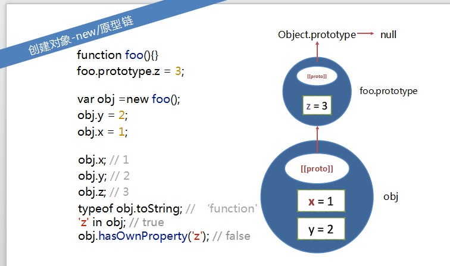
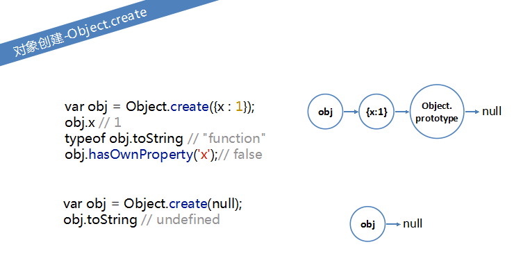
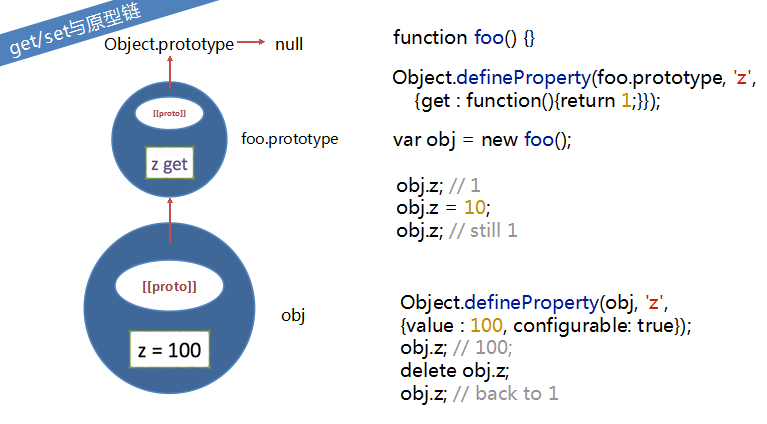
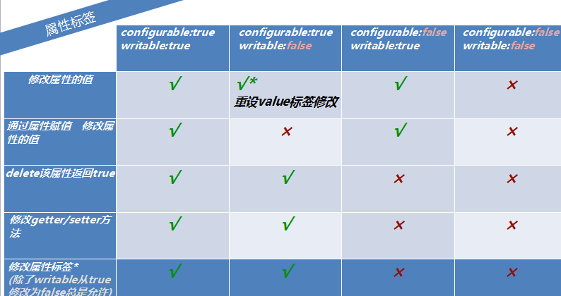

# Js ：

## 一、函数

### 1.1 函数的概念：

* 函数是一块JavaScript代码，被定义一次，但可执行和调用多次，js中的函数也是对象，所以js函数可以像其他对象那样操作和传递,所以我们也常叫js中的函数为函数对象。
关于函数的五个部分：this、arguments、作用域、不同调用方式、不同创建方法

### 1.2 函数的调用方式：

* 直接调用：foo();
* 对象方法：o.method()；
* 构造器：new foo();
* call  apply  bind

### 1.3 函数声明与函数表达式：

* 函数可以赋值给变量，可以作为参数传递

```javascript
fuction t1(){
//code
}//函数声明
t2=function(){
//code
}//函数表达式
```

* 在词法分析上，二者存在明确区别，前者在词法分析阶段起作用，后者在运行阶段起作用。


### 1.4、arguments

* 1、arguments是什么？
 是一个对象，是一个类数组对象
* 2、arguments内容是什么？
arguments是函数运行时的实参列表
* 3、arguments收集所有的实参，即使没有与之相对应的形参，形参与对应的arguments单元，其实是相互映射的，相互影响。
在词法分析中，首先按形参形成AO的属性，值为undefind。
当实参传来时，在修改AO的相应属性。
* 4、arguments的索引从0、1、2……递增，与实参逐个对应，
  + arguments.length属性代表实参的个数
  + arguments.callee代表”当前运行的函数”
  + arguments每一个函数都有，arguments只会在内部找自身的arguments，无法引用到外层的arguments


## 二、执行环境、作用域、词法分析及垃圾收集、闭包

### 2.1 执行环境(excution context)，有时简称为环境：

* 执行环境定义了变量或函数有权访问的其他数据，决定了他们各自的行为;
* 每个执行环境都有一个与之关联的变量对象，环境中定义的所有变量和函数都保存在这个对象中。虽然我们编写的代码无法访问这个对象，但解析器在处理数据时会在后台使用它。
* 全局执行环境是最外围的一个执行环境，在web浏览器中，全局执行环境被认为是window对象。每一个函数都有自己的执行环境。
* 某个执行环境的所有代码执行完毕后，该环境被销毁，保存在其中的所有变量和函数定义也随之销毁(全局执行环境直到应用程序退出，如关闭网页或浏览器时才会被销毁)。
* 执行流控制机制：当执行流进入一个函数时，函数的环境就会被推入一个环境栈中。而在函数执行之后，栈将其环境弹出，将控制权交给之前的执行环境。

### 2.2 作用域链(scope chain)

* 当代码在一个环境中执行时，会创建变量对象的一个作用域链.
* 作用域链的前端，始终都是当前执行的代码所在环境的变量对象。如果这个环境是函数，则将其活动对象(active object)作为变量对象。
作用域链中的下一个变量对象来自包含(外部)环境，而再下一个变量对象则来自下一个包含环境。这样一直延续到全局执行环境；
全局执行环境的变量对象始终都是作用域链中的最后一个对象。


1. 在函数嵌套中，变量(标识符)是如何查找的？ 首先从作用域链前端开始，在局部环境(函数内部)寻找，寻找不到，则向外层寻找，直到全局（Window）环境的变量对象。
2. var，是在函数运行的上下文中，声明一个变量，如果不加var，则认为是一个赋值操作，但不要狭隘的理解为声明一个全局变量。

### 2.3 词法分析过程:

* js代码执行：
  + JavaScript代码自上而下执行，但是js代码在执行前，会先有词法分析过程，所以事实上，js运行要分为词法分析和执行两个阶段。
  + 所以即使当前要打印的变量的声明代码在后面，还没有运行到，但系统会在词法分析期间默认已经有了这个变量，所以结果是undefine，而不是报错。
* 词法分析主要分为3步：
   + 第一步：先分析形参
   + 第二步：分析变量声明
   + 第三步：分析函数声明
* 如果存在函数嵌套，则从外往内进行词法分析；
* 一个函数能够使用的局部变量，就从上面3步分析而来。
* 具体步骤：
  + 0：函数运行前的一瞬间，生成ative object(活动对象)，形成AO
  + 1：
    - 1.1 函数声明的形数，生成AO的属性，值是undefined，
    - 1.2 接收实参，给刚刚形成AO的属性的形参赋值。
  + 2：分析var变量声明：如 `var age`,
    - 2.1 如果AO上还没有age属性，则添加AO属性，值是undefined，
    - 2.2 如果AO上已经有age属性，则不做任何操作.
  + 3：分析函数声明，如`function foo(){}`
    - 3.1 如果AO上还没有foo属性,则把函数赋给AO.foo属性.
    - 3.2 如果此前foo属性已存在，则会被直接覆盖，把函数赋给AO.foo属性.
* 如果存在函数嵌套，则从外往内进行词法分析；--此时就形成了作用域链
* 进行词法分析之后，进行执行阶段，赋值发生在执行阶段。

* 例题：

```javascript
function fun(greet){
    var greet="hello";
    console.log(greet);
    function greet(){

    }
    console.log(greet);
}
fun(null);//hello   hello
fun("nice");//hello hello
```

```javascript
function func(greet){
    var greet;
    console.log(greet);
    function greet(){

    }
    console.log(greet);
}
func(null);//function grret(){}  function grret(){}
func("nice");//function grret(){}  function grret(){}
```

 ```javascript
function func(greet){
    console.log(greet);
    greet=function (){

    }
    console.log(greet);
}
func(1);//1 function(){}
```

### 2.4 作用域链其他知识点

* 作用域链本质上是一个指向变量对象的指针列表，它只引用但不实际包含变量对象。
* AO链其实可以认为就是作用域链。找变量时由内向外找，分析AO链时由外向内分析
* Js三个重要组成部分：作用域链、原型链、闭包
* 当一个函数运行的时候，函数内部能引用的变量有：AO、arguments、this
* 对于arguments和this，每个函数都有自己独有的arguments和this，且不进行链式查找
* this对象是在运行时基于函数的执行环境绑定的
* 作用域链应用实例：JQuery中的最外层函数中将window对象作为参数传入，这样可以加快函数内变量的查找速度,其中不传值undefined的原因之一是方法智障给undefined赋值。

```javascript
(function(window,udefined){})(window);
```


### 2.5 垃圾回收机制

1. js的设计者为了让没有必要的变量保存在内存中，设计了垃圾回收机制（我们写的任何变量都是需要内存空间的），什么叫没有必要的变量？也就是说你不在需要这个变量的时候它就会被销毁？那么你肯定会问js怎么知道那些变量是我们不需要的哪些是我们需要的。所以js为了知道哪些变量需要保存下来，哪些不需要保存下来，会进行一些判断。接下来我们就一起看看js是怎么判断的。
* 1.在js中定义的全局变量是不会被销毁的，因为我们随时都可能会用到这个变量，所以不能被销毁。
* 2.但是在函数中定义的变量就不一定了，而且由于在函数的定义的变量的生命周期在执行完这个函数就销毁的原因自然就保存不了上一次的值。
  + 但是并不是说函数就真的保存不了上一次的值，因为有的时候我们确实需要上一次的值，所以js判断是否需要保存上一次变量的值的时候就会遵守这样的一个规则。
  + 规则，如果这个函数有被外部的变量引用就不会销毁（这句话说的不够准确，下面代码会一步一步解释），否则销毁
* 可以比较下面两个例子

```javascript
//例一
function a(){
    var b = 0;
    return function(){
        b ++;
        console.log(b);
    }
}

a()();//1
a()();//1


//例二
function a(){
    var b = 0;
    return function(){
        b ++;
        console.log(b);
    }
}
//此处其实就是使用了闭包

var d = a();//函数a的执行执行完成后，其活动对象并未被销毁,因为匿名函数的作用域链仍然在引用这个活动对象
d();//1
d();//2
```

* 总结：
  + 1、如果一个对象不被引用，那么这个对象就会被GC回收；
  + 2、如果两个对象互相引用，但是没有被第3个对象所引用，那么这两个互相引用的对象也会被回收。

[参考文章](http://www.cnblogs.com/pssp/p/5211637.html 'GC')

### 2.5 闭包

1. 闭包
* 闭包是指有权访问另一个函数作用域中变量的函数。
* 作用域链是理解闭包的关键；
 
```javascript
//闭包计数器例子
//这样其他人就无法访问到counter,可以解决变量污染的问题
var count=(function(){
    var counter=0;
    return function(){
       return ++counter;
        
    }
})();
console.log(count());//1
console.log(count());//2

```

* 友情延伸-个人命名空间

```javascript
var wjj={};//个人命名空间
wjj.count=(function(){
    var counter=0;
    return function(){
       return ++counter;
        
    }
})();
console.log(wjj.count());//1
console.log(wjj.count());//2

```
2. 闭包中的this

```javascript
var name="window"; 
var obj={
    name :"obj",
     getName: function(){
         var that=this;
         return function(){
             return that.name;
        }
    }
}
console.log(obj.getName()());//obj
```

* 此例子中涉及到this的特点：this是运行时基于函数的执行环境绑定的；
* this arguments均存在这样的问题，在闭包中，要注意将其保存在闭包能访问的变量中

## 三、apply与call及bind的用法意义及区别

1. apply与call都是改变上下文中的this并立即执行这个函数，(调用一个对象的一个方法，以另一个对象替换当前对象)对于apply和call两者在作用上是相同的，但两者在参数上有区别的。对于第一个参数意义都一样，都是要传入给当前对象的对象;
但对第二个参数：apply传入的是一个参数数组，也就是将多个参数组合成为一个数组传入，而call则作为call的参数传入（从第二个参数开始）。

* 如 `func.call(func1,var1,var2,var3)`对应的apply写法为：`func.apply(func1,[var1,var2,var3])` ,同时使用apply的好处是可以直接将当前函数的arguments对象作为apply的第二个参数传入

```javascript

//例一
 function Obj(){
    this.value="对象！";
}
var value="global 变量";
function Fun1(){
    alert(this.value);
}
window.Fun1();   //global 变量
Fun1.call(window);  //global 变量
Fun1.call(document.getElementById('myText'));  //input text
Fun1.call(new Obj());   //对象！

//例二
var func=new function(){
    this.a="func"
}
 var myfunc=function(x){
  var a="myfunc";
  alert(this.a);
  alert(x);
}
 myfunc.call(func,"var");
//弹出 func var

//例三
var a = {
    user:"追梦子",
    fn:function(e,ee){
        console.log(this.user); //追梦子
        console.log(e+ee); //11
    }
}
var b = a.fn;
b.apply(a,[10,1]);

```

2. bind同样可以改变对象的指向，但实际上bind方法返回的是一个修改过后的函数，并不像apply和call会立即执行。

```javascript

var a = {
    user:"追梦子",
    fn:function(){
        console.log(this.user); //追梦子
    }
}
var b = a.fn;
var c = b.bind(a);
console.log(c);
c();

```

* 总结 call和apply都是改变上下文中的this并立即执行这个函数，bind方法可以让对应的函数想什么时候调就什么时候调用，并且可以将参数在执行的时候添加，这是它们的区别，根据自己的实际情况来选择使用

## 四、this

* this的指向在函数定义的时候是确定不了的，只有函数执行的时候才能确定this到底指向谁，实际上this的最终指向的是那个调用它的对象（这句话有些问题，后面会解释为什么会有问题，虽然网上大部分的文章都是这样说的，虽然在很多情况下那样去理解不会出什么问题，但是实际上那样理解是不准确的，所以在你理解this的时候会有种琢磨不透的感觉），那么接下来我会深入的探讨这个问题。

* js中函数的5种调用方式

1. 全局的this(浏览器）：指向window

 ```javascript
 console.log(this.document===document);//true

 conosle.log(this.window===window);//true

 this.a=37;
 console.log(window.a);//37
```

2. 一般函数调用的this:指向window

```javascript
function f1(){
    return this;
}
f1()===window;//true

function f2(){
   "use strict";
   return this;
}
f2();//undefined
f2()===window; //false
```

* 作为普通函数来调用时this的值->window,准确来说，this为null，但被解释为window,在ECMASCRIPT标准中，如果this为null，则被解释成undefined

3. 作为对象的方法来调用时：this指向方法的调用者，即该对象

* 例一中第二次调用时'(o.f)()'之所以值依然是37，原因是因为'o.f'和'(o.f)'的定义是相同的；第三次调用时是先发生了赋值，然后调用赋值后的返回函数，所以是12

```javascript
//例一
var age=12;
var o={
  age:37,
　f:function(){
　　　return this.age;
　}
}
console.log(o.f());//37
console.log((o.f)())//37
console.log((o.f=o.f)())//12

//例二
var o={prop:37};
function indepent(){
　　return this.prop;
}
o.f= indepent;
console.log(o.f());//37

//例三
var o={
     a:37,
     b:{
        a:12,
        fn:function(){
            console.log(this.a);
        }
     }
};
o.b.fn();//12

//例四
var o={
     a:37,
     b:{
        a:12,
        fn:function(){
            console.log(this.a);//undefined
            console.log(this);//window
        }
     }
};
var j=o.b.fn;
j();

```

* this指向的永远是最后调用它的对象，即执行时是谁调用的
* get/set方法:也是会指向get/set方法所在的对象

4. 原型链上的this

```javascript
var o={
    f:function(){
    return this.a+this.b;
    }
};
var p=Object.create(o);
//通过object.create()创建了一个对象p,p为空对象，且她的原型会指向o
p.a=1;
p.b=4;
console.log(p.f());//5
```

* 不管是原型链上的还是对象本身的，调用时都是指向p这样一个对象的

5. 作为构造函数调用时

* Js中没有类的概念，创建对象是用构造函数来完成的，或者直接用json格式{}来写对象
* New Dog发生了一下几个步骤：
  + A:系统创建空对象
  + B:把函数的this---》指向----》该空对象
  + C:执行该函数
  + D：返回该对象
* 构造函数运行时，对于return语句是忽略的
* 函数被call、apply调用,语法格式：函数.call(对象，参数1，参数2...参数N);


```javascript
 function t(num){
     alert("我的真实年龄是"+this.age);
     alert("但我一般告诉别人我"+(this.age+num));
 }
 var human={name:"lisa",age:20};
 human.t=t;
 human.t(-10);
 var wangwu={name:"wangwu",age:30};
 t.call(wangwu,5);
 //fn.call(对象obj，参数1，参数2...参数N);
 //运行如下：fn函数中this指向对象obj,运行fn(参数1，参数2...参数N)；
```

关于this的几道题目：

```javascript
name="this is window";
var obj={
    name:"php",
    function(){
     alert(this.name);
   }
}
var dog={name:"huzi"};

obj.t();//php

var tmp=obj.t;
tmp();

dog.t=obj.t;
dog.t();

(dog.t=obj.t)();

dog.t.call(obj);//php
```

* tmp 和(dog.t=obj.t)()所指向的母体不同，前者是window，后者是null，被解释为window

6. 新思路

* [利用call来分析this问题的思路参考文章](http://www.imooc.com/article/1758 "Title").
* 把一个函数调用替换成funcName.call的形式，从而理解运行时上下文中this到底指向谁。总结来说就是下面两个等价变形：
  + `foo() ---> foo.call(window)`
  + `obj.foo() --> obj.foo.call(obj)`
  + 只要理解以上两个变形，this就不再是问题啦！！
* 例五：

```javascript
 var x = 10;
var obj = {
    x: 20,
    f: function(){ console.log(this.x); }
};

obj.f(); // obj.f.call(obj)
// ==> 20

var fOut = obj.f;
fOut(); // fOut.call(window)
//==> 10

var obj2 = {
    x: 30,
    f: obj.f
}

obj2.f(); // obj2.f.call(obj2)
//==> 30
```

* 例五有些同学会可能出错的原因，是没有明确我上面说的：this是在执行时才会被确认的
* 用于构造函数，先看一段代码：

```javascript
func person(name) {
 this.name = name;
}
var caibirdme = new person("deen");
// caibirdme.name == deen
```

* 我上面也说了，函数在用作构造函数时同样可以用call方法去代替，那这里怎么代替呢？这里你又需要明确一点：new constrcut()是一种创建对象的语法糖它等价于

```javascript
    function person(name) {
       this.name = name;
    }
    var foo = new person("deen");
    //通过new创建了一个对象
    //new是一种语法糖，new person等价于
    var bar = (function(name) {
        var _newObj = {
            constructor : person,
            __proto__ : person.prototype,
        };
        _newObj.constructor(name); // _newObj.constructor.call(_newObj, name)
        return _newObj;
    })();
```

So you can see……为什么new的时候this就指向新的对象了吧？


## 五、Js对象概述

### 5.1 概念：

* 对象中包含一系列的属性，这些属性是无序的，每个属性都有一个字符串key和对应的value。

```javascript
var obj={x:1,y:2};
obj.x;
obj.y;
```

1. 关于key，无论是把数字还是别的设置为key，实际上都会先先转化为字符串，然后才作为实际上的key；如示例中的key为1时，实际上是转化为字符串`”1”`作为key的；其中有方括号表示法和点表示法两种方法；方括号表示法的好处是可以通过变量来访问属性.

```javascript
var obj={};
obj[1]=1;

obj["1"];

obj[{}]=3;
obj;

var obj1={"x":1,y:2};
obj1;
```

2. js对象中的属性是可以动态添加和删除的
js对象中每一个属性都有writable、enumerable、configurable 、value的标签，还提供了Get/set方法，这些东西可以为每一个属性提供一些访问权限的控制；（对应于属性所以可以说是属性标签）
除了每一个属性会有一些标签和get、set方法以外，每个对象都有一个原型，比如创建一个函数，每个函数都会有一个prototype属性；
除此之外，对象还有一个`[{class}]`标签来表示它是属于哪一个种类的，还有一个`[{extensible}]`标签来表示这个对象是否允许继续添加新的属性；(对应于对象，可以说是对象标签).

### 5.2 创建对象、原型链：

 创建对象的方法：
1. 创建对象-字面量：`var obj2 = {    x : 1,    y : 2,    o : {        z : 3,        n : 4    }};`

2. 创建对象-new(涉及原型链介绍)：

* 对象自己都会有一个属性prototype，它是一个对象属性，
* 用new方法构造一个对象，它的特点是它的原型会指向它的构造器的prototype属性
 构造函数的原型
 


* 关于 toString的解释：在对象原型链的末端都会有一个objecct.prototype，而toString是在prototype上，所以可以通过toString拿到function

* 再上一个图的基础上继续做如下图操作:


说明obj.z在使用时，如果obj本身没有，就会沿着原型链向上查找；如果给obj添加上一个z的属性，也不会影响foo.prototype.z

3. 创建对象-object.create
* 他是一个系统内置的一个函数，它会接收一个参数，一般是一个对象，它会返回一个新创建的对象，并让这个对象的原型指向这个参数；



### 5.3、读写对象属性:

1. 属性异常  删除属性  检测属性 枚举属性
* `[[configurable]]`:表示能否使用delete操作符删除从而重新定义，或能否修改为访问器属性。默认为true;
* `[[Enumberable]]`:表示是否可通过for-in循环返回属性。默认true;
* `[[Writable]]`:表示是否可修改属性的值。默认true;
* `[[Value]]`:包含该属性的数据值。读取/写入都是该值。

2. 属性读写

```javascript
 //属性读写
 var obj={x:1,y:2};
 obj.x;//1
 obj["y"];//2

 obj["x"]=3;
 obj.y=4;

 var obj={x1:1,x2:2};
 var i=1;n=2;
 for(;i<=n;i++){
     console.log(obj['x'+i]);
 }//1,2

 var p;
 for(p in obj){
     conosle.log(bj[p]);
 }
```

3. 属性删除，有些属性是不可删除的 比如下面例子中的prototype

```javascript
//属性删除
var person={age:29,title:"fe"};
delete person.age;//true
delete person["title"]//true;
person age;//undefined
delete person.age;//true

delete Object.prototype;//false

var descriptor=Object.getOwnPropertyDescriptor(Object,"prototype");
descriptor.configurable;//false
```

用var定义的全局变量不可删除;在函数中用var定义的局部变量也不可删除，当然函数更不会被删除
特例 ：通常情况下，使用var去声明的变量，不能被delete，例如：

```javascript
var abc = 100;
delete abc; // 返回true
 abc; // 还是100
```

但是在eval代码里，就会不同，例如：

```javascript
eval("var abc = 100;console.log(delete abc); console.log(abc);"); // 返回true, undefined...
```

4. 属性检测

```javascript
//属性检测
var cat=new Object;
cat.legs=4;
cat.name="kitty";

'legs' in cat;//true
'abc' in cat;//false
'toString' in cat;//true inherited property!!!

cat.hasOwnProperty('legs');//true
cat.hasOwnProperty('toString');//false
cat.propertyIsEnumerable('legs');//true
cat.propertyIsEnumerable('toString');//false
```

* Enumerable表示是否可以被枚举
* 定义属性 `defineProperty()`,`Object.defineProperty(obj, prop, descriptor)`方法接收三个参数：需要添加或修改属性的对象，属性名称，属性描述options。
由于undefined==null,所以想让属性值不等于undefined，就要使用！==

```javascript
//属性检测
Object.defineProperty(cat,'price',{enumberable:false,value:1000});
cat.propertyIsEnumerable('price');//false
cat.hasOwnProperty('price');//true

cat.propertyIsEnumerable('toString');//false
if(cat&&cat.legs){
    cat.legs *=2;
}
if(cat.legs!=undefined){
    //!==undefined,or,!==null
}
```

* 属性枚举

```javascript
//属性枚举
var o={x:1,y:2,z:3};
'toString' in o;//false
o.propertyIsEnumerabe('toString');//false
var key;
for(key in o){
    console.log(key);//x,y,z
}

var obj=Object.create(o);
obj.a=4;
var key;
for(key in obj){
    cnsole.log(key);//a,x,y,z
}

var obj=Object.create(o);
obj.a=4;
var key;
for(key in obj){
    if(key in obj){
        if( cat.hasOwnProperty(key)){
            console.log(key);
        }
    }
}
```

5. Get/set方法

* 属性getter/setter方法

```javascript
//属性getter/setter方法
var man={
    name:'Bosn',
    weibo:'@Bosn',
    get age(){
        return new Date().fullYear()-1988;
    },
    set age(val){
        console.log('Age cant be set to'+val);
    }
};
console.log(man.age);//27
man.age=100;//
console.log(man.age);//27
```

* get/set与原型链



### 5.4、属性级的权限设置

Object.getOwnPropertyDescriptor()方法可以取得给定属性的特性：
 

### 5.5、对象标签

1. [{proto}] 原型标签、[{class}]、[{extensible}]

2. 序列化

* 如果属性值为undefined，将不会出现在序列化之后的结果中，
* 如果属性值NaN,infnity,将会转化为null，如果是时间，将会转化成UTC的时间格式

```javascript
//序列化
var obj={ x:1, y:true,z:[1,2,3],nullVal:null};
JSON.stringify(obj);//"{"x":1,"y":true,"z":[1,2,3],"nullVal":null}"

var obj={ val:undefined,a:NaN,b:Infinity,c:new Date()};
JSON.stringify(obj);//"{"a":null,"b":null,"c":"2016-12-22T14:31:58.240Z"}"

var obj=JSON.parse('{"x":1}');
JSON.stringify(obj);//"{"x":1}"
```

* 使用json的Stringfy()方法序列化，返回一个字符串
* 使用parse()方法，把json对象转化为js对象，此外主义json中的键要用双引号引起来

* 序列化自定义

```javascript
var obj={
    x:1,
    y:2,
    o:{
        o1:1,
        o2:2,
        toJSON:function(){
             return this.o1+this.o2
        }
    }
};
JSON.stringify(obj);//"{"x":1,"y":2,"o":3}"
```

## 六、js对象的特点,js对象和json的一些对比比较

### 6.1 js对象的特点:

1. Js对象不依靠类而存在，可直接生成
　　总结：Js中的对象，就是“一组属性与值的集合”，属性可以任意添减，方法和属性不必区分
2. Js面向对象的私有属性和封装
    通过闭包来完成js面向对象的私有属性和封装

```javascript
function girl(name,bf){
    var secret=bf;
    this.name=name;
    this.showlove=function(){
        return secret;
    }
}
var g=new girl('lindaiyu','jiabaoyu');
alert(g.name+'xihuan'+g.showlove())
```

### 6.2 js对象和json的一些对比比较:

　　关于JSON（JavaScript Object Natation），简单的说就是轻量级的用于交换数据的格式，基于javascript 语法的子集，即数组和对象表示。
　　每一个数据都是一对键和值，用 , 分隔开。每一个键和值用 :分割开。
　　json 里的键和 Javascript 的对象标识符是不同的概念，必须用双引号包裹包裹。在 Javascript 对象里，对象标识符可以不用引号，用单引号或双引号。string 可以用单引号或双引号来表现。而在 json 的 概念里的 string，其表现形式为必须用双引号包裹。
　通过eval() 函数可以将JSON字符串转化为对象。 


## 七、原型：prototype和__proto__

### 7.1 对prototype和__proto__的理解:

[javascript核心指南](http://www.cnblogs.com/ifishing/archive/2010/12/08/1900594.html "Title") 

一个对象的隐式原型指向构造该对象的构造函数的原型,
如果一个对象没有明确指定原型，那“__proto__”的默认值为Object.prototype。对象 “Object.prototype” 自身也有一个“__proto__”，它是整个原型链的 最后一环(final link)并且值为 null. 

链接：
[prototype和__proto__的关系](https://www.zhihu.com/question/34183746/answer/58155878 "Title") 


* 首先，要明确几个点：在JS里，万物皆对象。方法（Function）是对象，方法的原型(Function.prototype)是对象。因此，它们都会具有对象共有的特点。即：对象具有属性__proto__，可称为隐式原型，一个对象的隐式原型指向构造该对象的构造函数的原型，这也保证了实例能够访问在构造函数原型中定义的属性和方法。
方法(Function)方法这个特殊的对象，除了和其他对象一样有上述_proto_属性之外，还有自己特有的属性——原型属性（prototype），这个属性是一个指针，指向一个对象，这个对象的用途就是包含所有实例共享的属性和方法（我们把这个对象叫做原型对象）。原型对象也有一个属性，叫做constructor，这个属性包含了一个指针，指回原构造函数。
好啦，知道了这两个基本点，我们来看看上面这副图。
  + 1.构造函数Foo()构造函数的原型属性Foo.prototype指向了原型对象，在原型对象里有共有的方法，所有构造函数声明的实例（这里是f1，f2）都可以共享这个方法。
  + 2.原型对象Foo.prototype,Foo.prototype保存着实例共享的方法，有一个指针constructor指回构造函数。
  + 3.实例f1和f2是Foo这个对象的两个实例，这两个对象也有属性__proto__，指向构造函数的原型对象，这样子就可以像上面1所说的访问原型对象的所有方法啦。另外：构造函数Foo()除了是方法，也是对象啊，它也有__proto__属性，指向谁呢？指向它的构造函数的原型对象呗。函数的构造函数不就是Function嘛，因此这里的__proto__指向了Function.prototype。其实除了Foo()，Function(), Object()也是一样的道理。原型对象也是对象啊，它的__proto__属性，又指向谁呢？同理，指向它的构造函数的原型对象呗。这里是Object.prototype.最后，Object.prototype的__proto__属性指向null。
* 总结：
  + 1.对象有属性__proto__,指向该对象的构造函数的原型对象。
  + 2.方法除了有属性__proto__,还有属性prototype，prototype指向该方法的原型对象。

### 7.2 判定原型关系常用方法

1. 判断对象与原型对象的关系：isPrototypeOf();
2. 检测一个属性是存在于实例中，还是存在于原型：hasOwnProperty()
 只有给定属性存在于对象实例中时，才会返回true;
3. Object.getPrototypeOf():返回[[protype]]的值;
4. typeof 和instanceof的区别
* typeof 是一个一元运算，放在一个运算数之前，运算数可以是任意类型。
* 它返回值是一个字符串，该字符串说明运算数的类型。typeof 一般只能返回如下几个结果：number,boolean,string,function,object,undefined。我们可以使用 typeof 来获取一个变量是否存在，如 if(typeof a!="undefined"){alert("ok")}，而不要去使用 if(a) 因为如果 a 不存在（未声明）则会出错，对于 Array,Null 等特殊对象使用 typeof 一律返回 object，这正是 typeof 的局限性。
* instanceof 用于判断一个变量是否某个对象的实例，如 var a=new Array();alert(a instanceof Array); 会返回 true，同时 alert(a instanceof Object) 也会返回 true;这是因为 Array 是 object 的子类。再如：function test(){};var a=new test();alert(a instanceof test) 会返回true


## 八、javascript中构造函数的返回值问题和new对象的过程

1. 首先明确一点：javascript中构造函数是不需要有返回值的，这一点跟java很类似。可以认为构造函数和普通函数的最大差别就是：构造函数中没有return语句，普通函数可以有return语句；构造函数中会使用this关键字定义成员变量和成员方法，普通的函数不会使用this关键字定义成员变量和方法。

2. 构造函数不需要显示的返回值。使用new来创建对象(调用构造函数)时，如果return的是非对象(数字、字符串、布尔类型等)会忽而略返回值;如果return的是对象，则返回该对象。

3. 下面简单介绍下，javascript中new对象的过程：如var myObj = newPerson(“aty”,25);
* 1.创建一个空的Object对象.var obj = new Object();
* 2.将构造函数Person中this指向刚创建的obj对象
* 3.将创建的obj的__proto__指向构造函数Person的prototype。这一步是建立对象和原型直接的对应关系。firefox下通过对象的__proto__属性能够访问到原型，IE下则没有暴露出相应的属性。
执行构造函数Person()中的代码

4. 关于js构造函数返回值的详细解释：
* 不管是在java或.net或javascript中，构造函数的里面的this只的就是将要得到的对象本身，在new的时候开辟内存空间，这个空间肯定是个object然后和this相连，(javascript并且原型应用会把函数的prototype给新的对象)。但是不同的是java或.net如果你在构造函数里面写return是会发生编译期错误的，因为他知道这个是构造函数不应该有return关键字。而javascript不一样，他可以有，如果你在javascript构造函数中写return，return了对象的话，他就会舍弃原先的内存空间及this,并且不会原型引用当前函数的prototype，而是得到直接的返回值，也就说，如果一个带返回值的方法，不管你 new还是不new得到的都是返回值的内容。

```javascript
//例一
function Person(name,sex){
    this.name=name;
    this.sex=sex;
    return this.name;
}
var obj=new Person('li',1);
obj//Person {name: "li", sex: 1}

//例二
function Person(name,sex){
    this.name=name;
    this.sex=sex;
    return {"returnValue":11};
}
var obj=new Person('li',1);
obj//Object {returnValue: 11}

//例三
function Person(name,sex){
    this.name=name;
    this.sex=sex;
    return {"returnValue":11};
}
Person.prototype.cc=function(){
    console.log("console");
}
var obj=new Person('li',1);
obj//Object {returnValue: 11}
obj.cc//undefined

//例四
function Person(name,sex){
    this.name=name;
    this.sex=sex;
    return this.name;
}
Person.prototype.cc=function(){
    console.log("console");
}
var obj=new Person('li',1);
obj//Person {name: "li", sex: 1}
onj.cc()//console

```

## 九、Js面向对象之静态方法

```javascript
 var harshiqi=function(){
    this.bark=function(){
        alert("wangwang");
    }
 }

harshiqi.ajax=function(){
    alert("ajax");
 }
 var h=new harshiqi();
 console.log(h);
 //H中没有ajax方法
 /*
 即:
 ajax()方法是基于”函数“本身的，和返回的对象没有关系
 bark要调用，必须要new harshiqi()得到对象，切有返回对象才能调用
使用ajax()方法要调用，不需要new对象，直接用harshiqi调用
 */
 h.bark();
 harshiqi.ajax()
```
* 之前是否接触过静态方法？
1. Math.random():静态方法
2. $.ajax():静态方法
3. 写jquery插件，2种办法
    通过闭包，吧方法写到jquery圆形上
    直接增加$的静态方法


## 十、ready与load执行方式区别

### 10.1 Jquery中使用的有：

```javascript
   $(function(){      })
   $(document).ready(function(){   })
   $( window ).on( "load", function(){   })
//其中$(function(){})是$(document).ready(function(){})的简写形式
```

JavaScript 中的以下代码 :

```javascript
Window.onload = function (){
    // 代码 
} 
//等价于 Jquery 代码如下：
$(window).load(function (){
  // 代码 
}); 


//但是二者也有不同

Window.onload = function (){ } //只能写一次  
$(window).load(function (){ }); //可以写多次


 //document ready
$(document).ready(function(){
    ...code...
})
//document ready 简写
$(function(){
    ...code...
})
//document load
$(document).load(function(){
    ...code...
})
```

### 10.2 ready与load

1. ready与load谁先执行：
    ready与load那一个先执行，那一个后执行？答案是ready先执行，load后执行。
2. DOM文档加载的步骤：

* 要想理解为什么ready先执行，load后执行就要先聊一下DOM文档加载的步骤：
  + (1) 解析HTML结构。
  + (2) 加载外部脚本和样式表文件。
  + (3) 解析并执行脚本代码。
  + (4) 构造HTML DOM模型。//ready
  + (5) 加载图片等外部文件。
  + (6) 页面加载完毕。//load
* 从上面的描述中大家应该已经理解了吧，ready在第（4）步完成之后就执行了。但是load要在第（6）步完成之后才执行。

3. ready事件：ready事件在DOM结构绘制完成之后就会执行。这样能确保就算有大量的媒体文件没加载出来，JS代码一样可以执行。
4. load事件：load事件必须等到网页中所有内容全部加载完毕之后才被执行。如果一个网页中有大量的图片的话，则就会出现这种情况：网页文档已经呈现出来，但由于网页数据还没有完全加载完毕，导致load事件不能够即时被触发。
5. 总结：

* 相信大家已经了解了ready与load的区别，其实如果页面中要是没有图片之类的媒体文件的话ready与load是差不多的，但是页面中有文件就不一样了，所以还是推荐大家在工作中用ready。
* 简单总结,具体这两者的区别如下：
  + 1.执行时间         window.onload必须等到页面内包括图片的所有元素加载完毕后才能执行。         $(document).ready()是DOM结构绘制完毕后就执行，不必等到加载完毕。 
  + 2.编写个数不同       window.onload不能同时编写多个，如果有多个window.onload方法，只会执行一个          $(document).ready()可以同时编写多个，并且都可以得到执行 
  + 3.简化写法          window.onload没有简化写法          $(document).ready(function(){})可以简写成$(function(){});
 